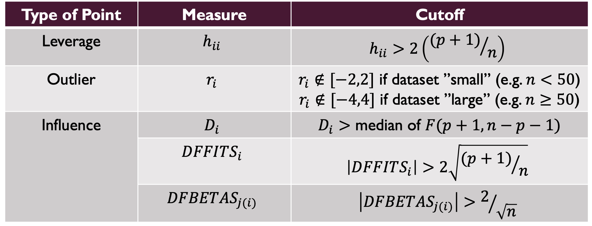

## Worksheet Information
**Goal of the worksheet:**  
  
The Module 8 worksheet is an opportunity to practice identifying problematic observations and recognizing the importance of assumptions in this process. By completing this worksheet, each student will be developing the skills to achieve the following weekly learning objectives:
\begin{itemize}
  \item Correctly identify problematic observations of each type.
  \item Explain the impact and importance of identifying each type of problematic observation.
  \item Recognize when problematic points can reasonably be removed and the impact of such actions.
\end{itemize}
This worksheet, in addition to the remainder of the class time, is **important practice for completing questions on the final exam, and for your final project**.
\
**Preparation assumed:**  
  
For hybrid sections: As part of the flipped design of the course, it is assumed that each student is attending this lecture having completed the following pre-class preparation:
\begin{itemize}
  \item Watched this week's module videos, attempted the Pre-Class Quiz, and accessed the code provided in the Guided Practice
\end{itemize}


For in person sections: 
\begin{itemize}
\item Please complete this worksheet after attending your in-person lectures for each week. If you did not attend class, please review the annotated slides posted on Quercus which will be posted on each week's Quercus Page.
\item Additional R/Coding resources are linked \href{https://q.utoronto.ca/courses/404559/pages/general-resources}{here}.
\end{itemize}
  
\
**How to complete this worksheet:**  
  
\begin{itemize}
  \item Students may work in groups of 2-3 if desired. However {\bf each student} must submit their worksheet to MarkUs to receive their completion credit. It is recommended that each student work on their {\bf own copy} of the assignment.
  \item All the code and course knowledge needed to complete this worksheet has been provided in the pre-class materials. It may help to have these open while working on this document.
  \item Follow the instructions provided in each question to complete the code.
  \item DO NOT change the names of the variables that store your final answers.
  \item When in doubt about a question in the worksheet or your code, ask a TA or the instructor during office hours or on the discussion board.
\end{itemize}
  
\
**Steps for submitting to MarkUs:**  

\begin{enumerate}
  \item Go to \href{https://markus.teach.cs.toronto.edu/markus}{MarkUs} and log in using your UofT credentials.
  \item Select this worksheet from the assignment list.
  \item Under Submissions, upload your Rmd file and select the file name from the list.
  \item Go to Automated Testing and select Run Tests to check your worksheet answers.
  \item You can submit as many times as you want, but only your latest submission before the deadline will be counted. 
    \item It is recommended you submit your file to \href{https://markus.teach.cs.toronto.edu/markus}{MarkUs} after you complete each activity to check your answers before moving on. You can submit multiple times to check your work, as your autograding tokens regenerate over time. 
\end{enumerate}

\
**What to do if a test fails on MarkUs**

\begin{enumerate}
  \item Don't panic. Your work won't really be graded until the deadline, so start early to make sure you have lots of time to resolve issues before the deadline.
  \item Read the message to get hints about what the problem is. For example "variable X not present" means that you may have a typo in your variable name.
  \item Double check the instructions for each question to ensure you are entering an answer in the correct format.
  \item Search on the discussion board to see if other classmates have encountered a similar error (and if not, consider posting a screenshot of the error message).
  \item Come to TA or instructor office hours with your issue.
\end{enumerate}

**The due date for MarkUs Worksheet 8 is Tuesday, November 11, at 11:59pm** 


\newpage
This week, we will be working with a dataset that comes with lots of interesting problems. The data `pgatour2006.csv` has been loaded to JupyterHub with your RMD worksheet. It contains the variables:

  - $Y$, PrizeMoney = average prize money per tournament
  - $X_1$, Driving Accuracy is the percent of time a player is able to hit the fairway with his tee shot.
  - $X_2$, GIR, Greens in Regulation, is the percent of time a player was able to hit the green in regulation. A green is considered hit in regulation if any part of the ball is touching the putting surface and the number of strokes taken is two or less than par.
  - $X_3$, Putting Average measures putting performance on those holes where the gree is hit in regulation (GIR).
  - $X_4$, Birdie Conversion % is the percent of time a player makes a birdie or better after hitting the green in regulation
  - $X_5$, SandSaves % is the percent of time a player was able to get "up and down" once in a greenside sand bunker.
  - $X_6$, Scrambling % is the percent of time that a player misses the green in regulation, but still makes par or better.
  - $X_7$, PuttsPerRound is the average total number of putts per round.

We will be using this dataset to practice identifying problematic observations and recognizing the importance of assumptions in this process. 

## 1) Problematic Observations before Transformation

Begin by fitting the original untransformed model that uses `PrizeMoney` as the response and the above 7 listed X variables as predictors. Store this model in the variable `model1` by replacing `NULL` with the `lm()` model.  
To identify problematic observations in this model, we first need to define the *number of observations, n*, and the *number of predictors, p* being used in our model. *n* can be found by using the function `nrow()` which takes the dataset `pga` as input, while *p* can be found by checking the `length()` of the vector of estimated coefficients `coef(model1)`, and subtracting 1 for the intercept.  
  
In the variable `n` below, replace `NULL` with `nrow(pga)` to count the number of observations. In the variable `p` below, replace `NULL` with `length(coef(model1))-1` to count the number of predictors.

```{r}
# load the data
pga <- read.csv(file="pgatour2006.csv", header=T)

# fit the linear model with 7 listed predictors and response Prize Money
model1 <- NULL

# use R functions to count the number of observations and the number of predictors
n <- NULL
p <- NULL
```

Next, using `n` and `p` from above, define each cutoff value that will be used to identify each type of problematic observation. See below for the formulae of each cutoff:



In each cutoff variable (`hcut`, `cookcut`, `fitcut`, `betacut`), replace `NULL` with the cutoff using `n` and `p` that were stored before. 

```{r}
# leverage cutoff
hcut <- NULL

# cook's distance cutoff
cookcut <- NULL

# dffits cutoff
fitcut <- NULL

# dfbeta cutoff
betacut <- NULL
```

Then, using the available R functions (`hatvalues`, `rstandard`, `cooks.distance`, `dffits`, and `dfbetas`), compute each problematic point statistic for the observations in `model1` and store them in each corresponding variable (`h_ii`, `r_i`, `D_i`, `dffits_i`, and `dfbetas_i`) in place of `NULL`.

```{r}
# leverage statistic
h_ii <- NULL

# standardized residuals
r_i <- NULL

# cook's distance 
D_i <- NULL

# dffits
dffits_i <- NULL

# dfbetas
dfbetas_i <- NULL
```

Finally, we can determine whether there exists any observations that are classified as each type of problematic point. We do this by asking R to list `which()` of the observations have a statistic that crosses the cutoff. If a comparison requires an absolute value, we use the `abs()` function. For outliers, you may consider this a large dataset. Run the code below to see these results.

```{r,eval=F}
# which observations are leverage points?
which(h_ii > hcut)

# which observations are regression outliers?
which(r_i > 4 | r_i < -4)

# which observations are influential by cook's distance?
which(D_i > cookcut)

# which observations are influential by dffits?
which(abs(dffits_i) > fitcut)

# which observations are influential by dfbetas?
for(i in 1:8){
  print(paste0("Beta ", i-1))
  print(which(abs(dfbetas_i[,i]) > betacut))    # this checks all betas in a loop
}
```

We want to investigate how many problematic points exist as well as if any one observation is problematic in multiple ways. 

**Question: Summarize the results of your diagnostics for problematic points. What type of point is most prevalent in your model and what does this tell you about your model? If there is any observation that is all types of problematic point, which player is this? If so, does this make sense?**  
TYPE YOUR ANSWER BELOW:  
  

## 2) Problematic Observations after Transformation

We already saw that this model does not satisfy assumptions and contains issues with multicollinearity. As such, we can refit the model using a transformed response that we already know addresses the violated model assumptions.  
  
Replace `NULL` in `lnPrize` with a natural log transformation of `PrizeMoney`, and store the model that uses this new response and the same predictors as earlier in `model2`. Then store the number of observations for this model in `n` and the number of predictors in `p` as before.

```{r}
# log-transform PrizeMoney
lnPrize <- NULL

# fit transformed model
model2 <- NULL

# use R functions to count the number of observations and the number of predictors
n2 <- NULL
p2 <- NULL
```

**Question: Do you think we will identify different problematic observations in model2 compared to model1? Why?**  
TYPE YOUR ANSWER BELOW:  
  
  
 
  
You should notice that `n` and `p` are the same as in model 1 and since these values determine the cutoff values we use to identify problematic points, we can simply use the samse cutoffs again. However, if we changed the number of predictors in the model, or deleted observations, we would have to recompute these cutoffs again.  
  
Let's compute new problematic observation statistics for `model2`, following the same process as before. Use the same R functions (`hatvalues`, `rstandard`, `cooks.distance`, `dffits`, and `dfbetas`) to do the computation and store the results in the corresponding values (`h_jj`, `r_j`, `D_j`, `dffits_j`, `dfbetas_j`).

```{r}
# leverage statistic
h_jj <- NULL

# standardized residuals
r_j <- NULL

# cook's distance 
D_j <- NULL

# dffits
dffits_j <- NULL

# dfbetas
dfbetas_j <- NULL
```

Finally, run the below code to see which observations are identified as problematic in each case.

```{r,eval=F}
# which observations are leverage points?
which(h_jj > hcut)

# which observations are regression outliers?
which(r_j > 4 | r_j < -4)

# which observations are influential by cook's distance?
which(D_j > cookcut)

# which observations are influential by dffits?
which(abs(dffits_j) > fitcut)

# which observations are influential by dfbetas?
for(i in 1:8){
  print(paste0("Beta ", i-1))
  print(which(abs(dfbetas_j[,i]) > betacut))    # this checks all betas in a loop
}
```

**Question: Is the observation that was problematic in all ways in model1 still problematic? Do you think it would have been a reasonable approach to remove that observation before checking and addressing model violations?**  
TYPE YOUR ANSWER BELOW:  
  
  
 
-----------------
END OF WORKSHEET - BE SURE TO SUBMIT YOUR WORKSHEET ON MARKUS TO RECEIVE COMPLETION CREDIT  
